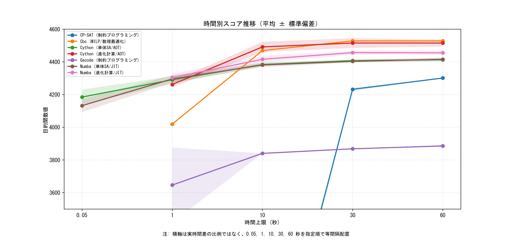
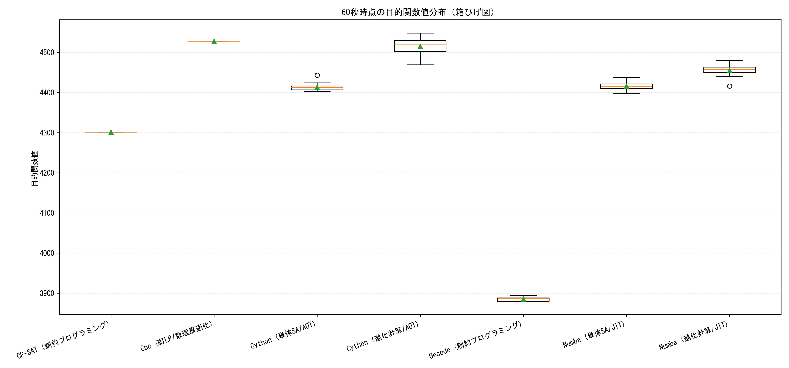
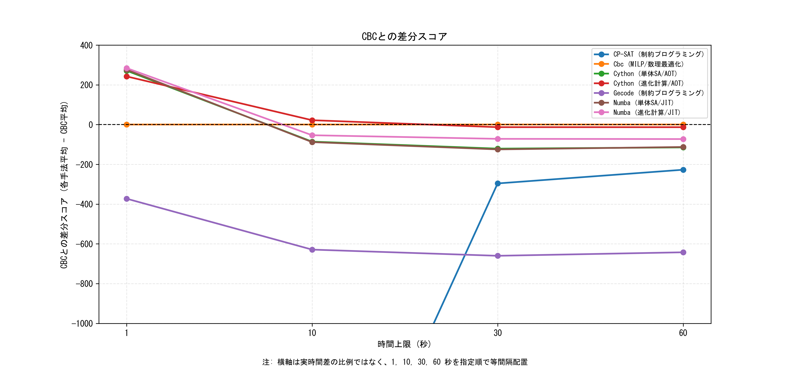

# fast-knapsack-cython
## 実務制約付きナップサック問題に対する時間予算ベースの解法比較

3行サマリ:
1. 実務制約付きの大規模ナップサック問題を、Cython / Numba / MiniZinc で同一時間予算比較するプロジェクト。
2. 焼きなまし法（SA）と進化計算の実装を中心に、短時間での実行可能解品質を統計的に評価する。
3. 単発結果ではなく、反復実験・検証・可視化まで含めて再現可能な比較基盤を提供する。

複数制約を持つ大規模ナップサック問題に対して、次の3系統を同じ時間予算で比較する実験プロジェクトです。

- Cython による AOT コンパイル済みヒューリスティック
- Numba による JIT コンパイル済みヒューリスティック
- MiniZinc 経由で実行する汎用ソルバー群（Cbc / CP-SAT / Gecode）

主眼は「最適性証明」ではなく、時間制約下でどこまで高品質な実行可能解に到達できるかを、統計的に比較可能な形で示すことです。

## 実行手順

### 1. 環境セットアップ

```bash
uv sync
```

### 2. 問題インスタンスを生成

```bash
uv run python scripts/generate_and_save_problem.py
```

### 3. Cython 拡張をビルド（Cython を使う場合のみ）

```bash
uv run python src/solver_cython/setup.py build_ext --inplace
```

### 4. ソルバーを実行

個別に確認する場合:

```bash
uv run python scripts/solve_with_cython.py --timeout 10 --no-full-output
uv run python scripts/solve_with_numba.py --timeout 10 --no-full-output
uv run python scripts/solve_with_minizinc_solvers.py --timeout 10 --no-full-output
```

時間予算ごとに一括で回す場合:

```bash
uv run python scripts/run_timeout_experiments.py
```

`run_timeout_experiments.py` は、デフォルトで全ソルバーを各時間予算ごとに20回実行します。

例: Cython と Numba の 60 秒だけ再実行:

```bash
uv run python scripts/run_timeout_experiments.py --solvers cython,numba --timeouts 60
```

### 5. レポートを生成

```bash
uv run python scripts/generate_report.py
```

## 現在の結論（要点）

- 0.05秒（単体SAのみ）では Cython 平均 4184.75、Numba 平均 4132.20 で、どちらも即座に実行可能解を返す
- 1秒ではヒューリスティック系（Cython/Numba）が Cbc（平均 4019）を上回る一方、CP-SAT はこの条件では有効解を安定して返せていない
- 10秒では Cython 進化計算（平均 4491.20）が Cbc（平均 4469）を上回る
- 30秒〜60秒では Cbc（平均 4528）が最上位で、Cython 進化計算（平均 4515.20 / 4515.05）が僅差で続く
- Numba 進化計算は 10秒〜60秒で単体SAより高い平均スコアを維持し、進化計算の有効性が確認できる

本リポジトリの主張は「常に厳密解法を上回る」ことではありません。時間予算に応じた実行可能解の品質を比較可能な形で示し、Cython / Numba 実装の調整自由度（制約追加や探索戦略変更のしやすさ）と、進化計算が持つ探索多様性を実験的に示すことにあります。

## レポート

`scripts/generate_report.py` は、時間窓ごとのデータからソルバーごとに最新20件までを集計し、次を出力します。

- 目的関数値の平均
- 目的関数値の標準偏差
- 試行数
- 実行時間の平均

図の横軸（0.05, 1, 10, 30, 60秒）は、実時間比ではなく指定順で等間隔に配置しています。CBC差分スコアは `各手法平均 - CBC平均` です。

### 時間別スコア推移（平均 ± 標準偏差）



### 60秒時点の目的関数値分布



### CBCとの差分スコア



## 比較設定

アルゴリズムは次の2種類で扱います。

- 決定論的ソルバー: Cbc / CP-SAT / Gecode
- 確率的ソルバー: Cython / Numba の焼きなまし法（SA）・進化計算

評価方針:

- 全ソルバーを複数回実行し、平均・標準偏差で比較する
- Cbc / Gecode は分散が小さいことが多いが、CP-SAT は時間制限下で結果がばらつく場合がある

時間予算:

- 0.05秒: Cython / Numba の単体焼きなまし法（SA）のみ
- 1秒
- 10秒
- 30秒
- 60秒

## 対象問題

「2,000個の商品候補から、制約を守りつつ価値の高い組み合わせを選ぶ」問題です。

- アイテム数: 2,000
- グループ数: 200
- 3次元の容量制約
- グループ間禁止ペア（排他制約）: 「グループAとグループBは同時に選べない」という禁止組を200組設定
- グループごとの上限制約: 各グループから選べる件数に上限がある
- グループ選択数に応じたボーナス: 同一グループから多く選ぶと追加価値が付く

組み合わせ総数は $2^{2000}$（約 $10^{602}$）で、総当たりは現実的に不可能です。

## 主要スクリプト

- `scripts/generate_and_save_problem.py`: 問題インスタンス生成
- `scripts/solve_with_cython.py`: Cython 実装の単体焼きなまし法（SA）/進化計算を実行
- `scripts/solve_with_numba.py`: Numba 実装の単体焼きなまし法（SA）/進化計算を実行
- `scripts/solve_with_minizinc_solvers.py`: MiniZinc 経由で Cbc / CP-SAT / Gecode を実行
- `scripts/run_timeout_experiments.py`: 複数時間予算・複数回実行の実験ランナー
- `scripts/generate_report.py`: 実行結果から統計レポートとグラフを生成

## 現在使っている高速化要素

- AOT / JIT コンパイルによる Python ループのネイティブ化
- OpenMP（Cython）および `parallel=True`（Numba）による進化計算の並列実行
- 排他制約のビットマスク化による高速判定

## 今後の改善候補

直近アクション:

- 箱ひげ図を確率的ソルバー中心に整理して可読性を上げる
- レポートに95%信頼区間を追加する
- 問題インスタンスを複数用意して単一インスタンス依存を減らす

長期R&D:

- MiniZinc 系ソルバーの `status` と `best bound` の整理を強化する
- C++ コア + pybind11 へ移行し、Cython 実装と性能比較する
- SA / 進化計算の中核ループのメモリ配置・乱数生成・並列化をさらに最適化する

## 位置づけ

これは「Cython が常に最強」であることを示すデモではなく、次を示すためのポートフォリオです。

- 制約の厳しい組合せ最適化問題を設計できること
- 厳密解法とヒューリスティックを同じ時間予算で比較できること
- Cython / Numba による高速化実装ができること
- 単発比較ではなく、統計的な見方を含めて結果を整理できること